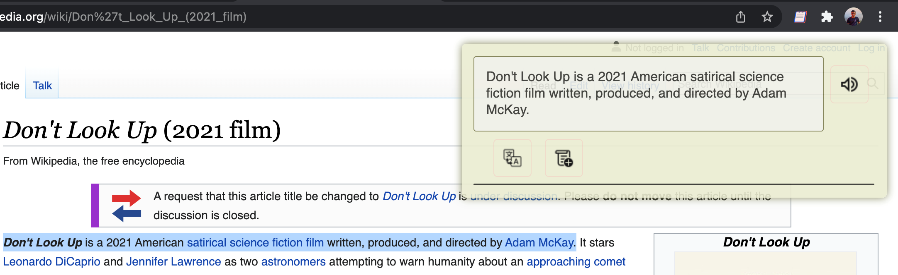
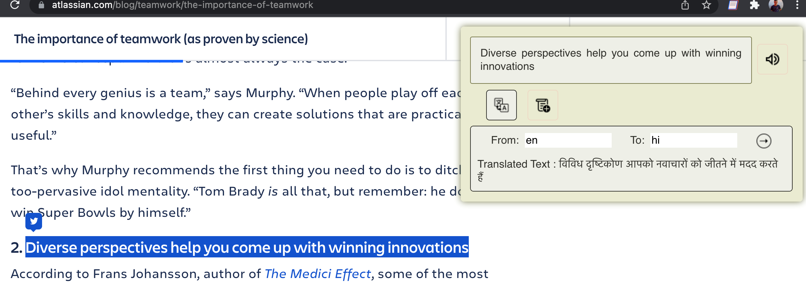
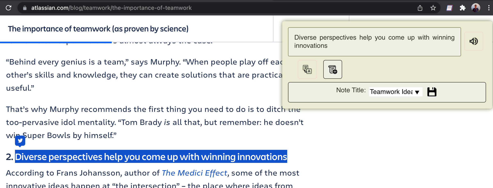
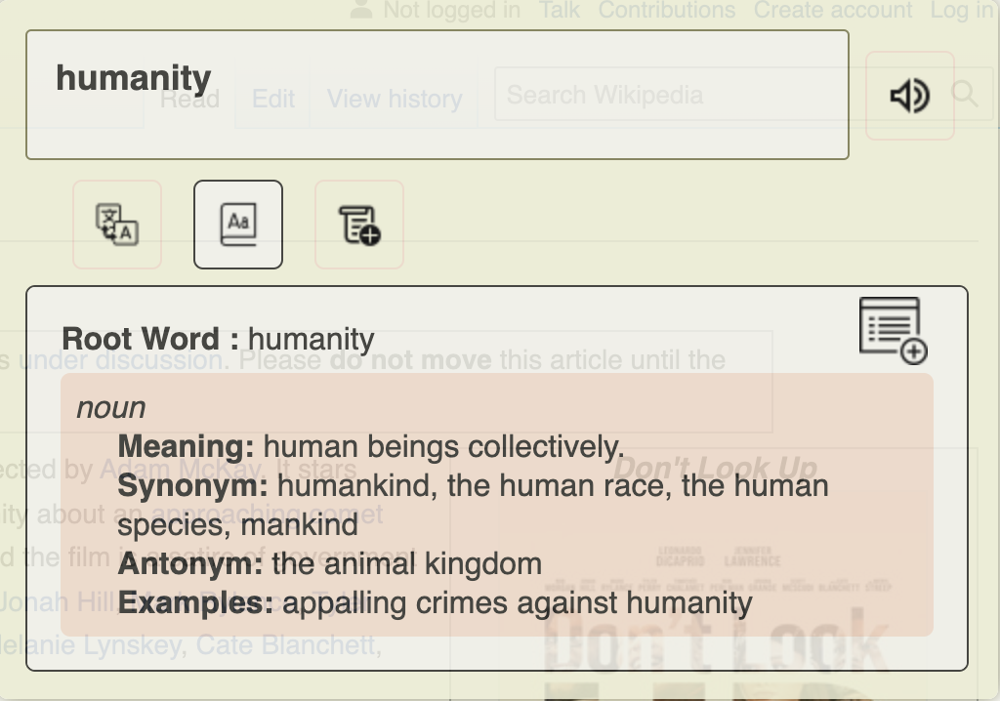
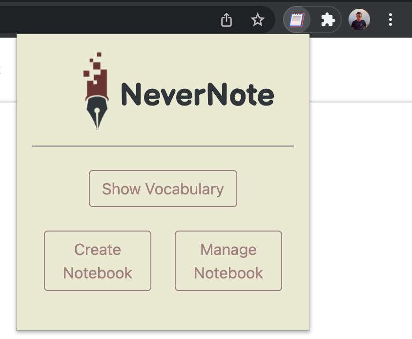
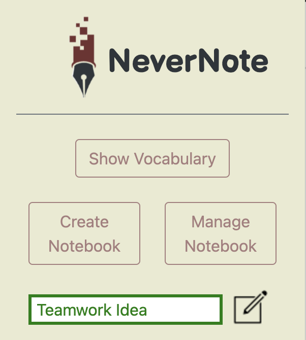
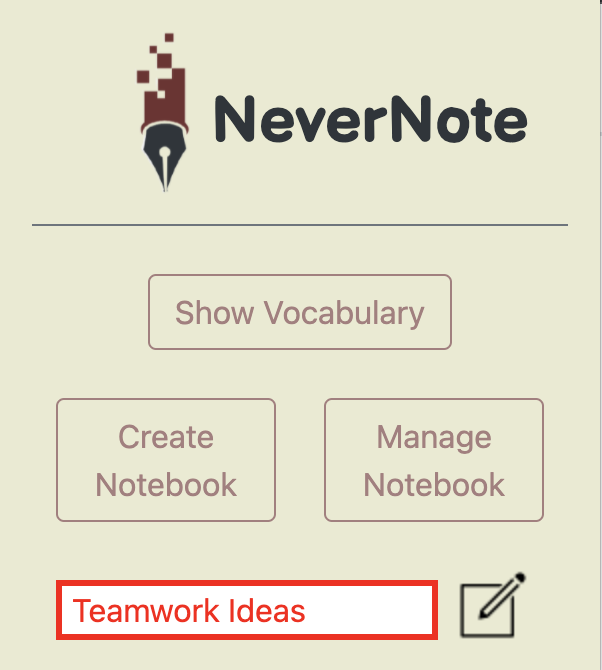
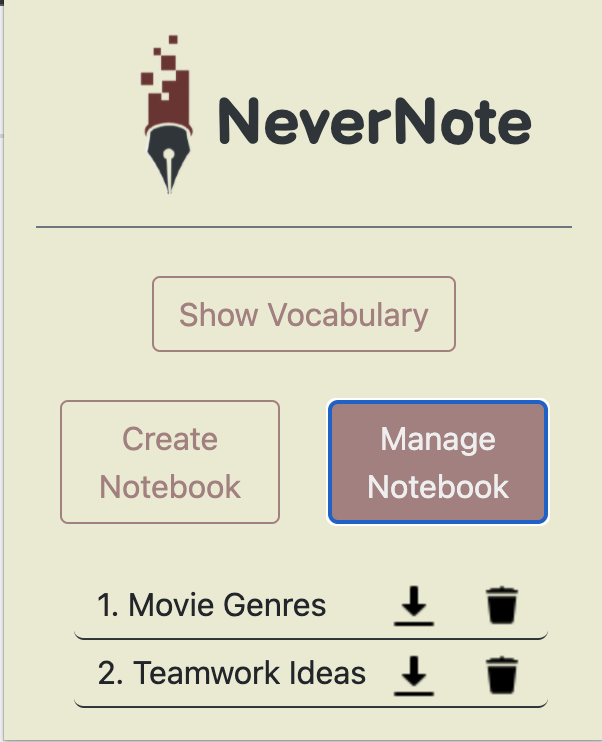
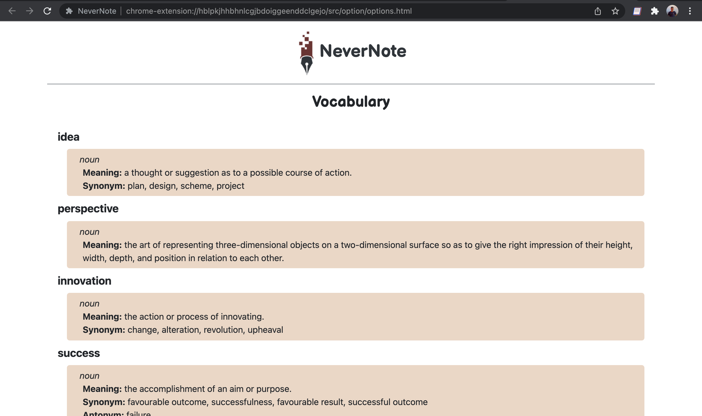
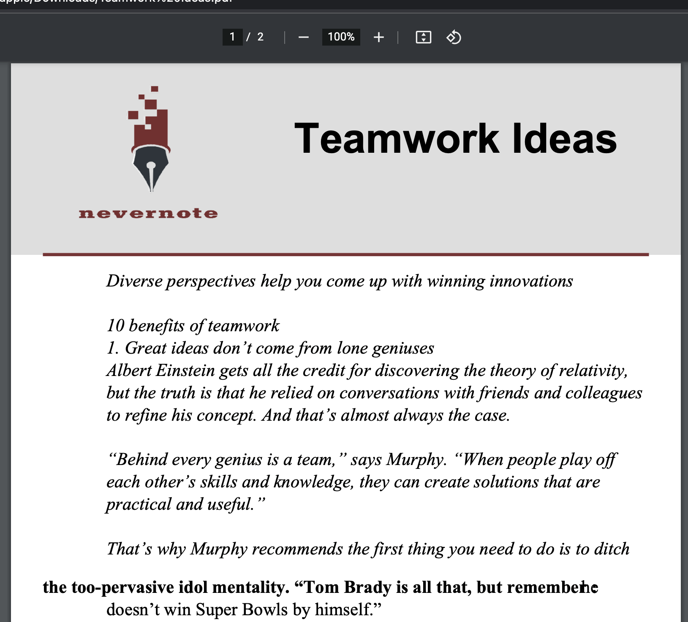

# NeverNote

## What is NeverNote
Let's look at an example to better understand the scenario. One pleasant day, you considered reading a research paper in your respective field. Because of their high standards language, you occasionally don't understand some sentences or words. People usually just google the things they don't understand in a different tab, which takes time and sometimes doesn't even get you the exact answer you're looking for. Let's say you were fortunate enough to learn the material, but you need to note down or put it in a document for future reference. Luckily, NeverNote comes to rescue at this point.

**NeverNote** is a user-friendly chrome extension that makes it simple to absorb complex words and sentences and save them in one place for future reference. It also helps you keep track of your essential points in separate files. You can also save your vocabulary with various other information to grasp the words. You don't need to leave your tab because all of these features are available in your current window. Basically, it saves a lot of time when reading information on the internet.

## Need
With the rapid advancement of technology, it is vital to adapt to the changing reality. Reading technical stuffs from various research papers and articles is today's need. For beginners, understanding such high standard stuffs can be time consuming as the manual work flow takes time. Nevernote reduces this time to a certain extent, so that you don't distract from your regular workflow. Basically, it's a one-stop shop for smooth online reading.

## Working
Press ctrl key and select some word or sentence, as you finish your selection a dialogue box would appear with various features which you can use as per your convinience. All the vocabulary and notes that you save are always available to be downloaded in pdf format.

### Features
- Get **meaning, synonyms, antonyms, and examples** of the selected word.
- Add words to your **vocab** with meaning to later revise and improvise vocabulary.
- Translate word/text in any language.
- Text to speech in any language
- Take **note** of selected text in a particular file.
- Download your vocabulary, notes in pdf format.

## Preview

#### Translate functionality

CTRL+Selecting Text triggers extension

 

Translate Text

 

Add To Notes

 

#### Search in Dictionary

</img>

Search for word in dictionary

 

#### Popup

Popup Layout

 

Create Notebook (name does not match any previous notebook)

 

Create Notebook (name matches with previous notebook)

 

Manage Notebooks

 

#### Vocabulary

Vocabulary Page

 

#### Notes PDF

Downloaded notes layout

 

## Installation

- **Fork and Clone** the repository.
- Add your api keys to apiKey.js in content folder according to example shown in exampleApiKey.js.
- Open Google Chrome and Go to **Menu > More tools > Extensions** or go to `chrome://extensions`.
- **Turn on the Developer mode button**.
- Click **Load unpacked**. Select **cloned folder** from your pc.
- You would find your extension on the Extensions list.
- Make sure the activation button is turned on.
- **Pin the extension** for better experience.

## Authors
- *Rutvij Vamja*: [RutivjDv](https://github.com/RutvijDv/)
- *Shrushti Vasaniya*: [Shrushti22](https://github.com/Shrushti22/)
- *Yash Patel*: [y4sh-patel](https://github.com/Y4sh-patel/)
